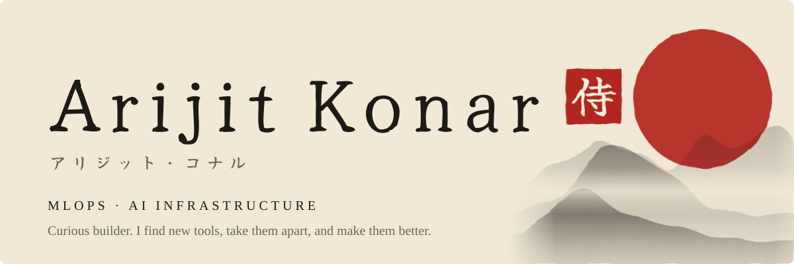

<picture>
  <source media="(prefers-color-scheme: dark)" srcset="assets/banner-dark.svg">
  
</picture>

  
  

<picture>
  <source media="(prefers-color-scheme: dark)" srcset="assets/heading-work-dark.svg">
  
</picture>

<a href="https://github.com/K4-LABS/gpumesh">
<picture>
  <source media="(prefers-color-scheme: dark)" srcset="assets/card-gpumesh-dark.svg">
  
</picture>
</a>
<a href="mailto:arijitkonar16@gmail.com?subject=Anchor%20demo">
<picture>
  <source media="(prefers-color-scheme: dark)" srcset="assets/card-anchor-dark.svg">
  
</picture>
</a>
<a href="https://github.com/Samurai007AK/HiddenHelp">
<picture>
  <source media="(prefers-color-scheme: dark)" srcset="assets/card-hiddenhelp-dark.svg">
  
</picture>
</a>

<picture>
  <source media="(prefers-color-scheme: dark)" srcset="assets/heading-the-path-dark.svg">
  
</picture>

<!-- trail:start -->

<a href="https://github.com/risa-labs-inc/BossConsole/pulls?q=is%3Apr+author%3ASamurai007AK"><picture><source media="(prefers-color-scheme: dark)" srcset="https://raw.githubusercontent.com/Samurai007AK/Samurai007AK/output/row-0-dark.svg"></picture></a>
<a href="https://github.com/ApodexAI/FrontierAgent/pulls?q=is%3Apr+author%3ASamurai007AK"><picture><source media="(prefers-color-scheme: dark)" srcset="https://raw.githubusercontent.com/Samurai007AK/Samurai007AK/output/row-1-dark.svg"></picture></a>
<a href="https://github.com/codeforstartups/dynavec/pulls?q=is%3Apr+author%3ASamurai007AK"><picture><source media="(prefers-color-scheme: dark)" srcset="https://raw.githubusercontent.com/Samurai007AK/Samurai007AK/output/row-2-dark.svg"></picture></a>
<a href="https://github.com/K4-LABS/gpumesh/pulls?q=is%3Apr+author%3ASamurai007AK"><picture><source media="(prefers-color-scheme: dark)" srcset="https://raw.githubusercontent.com/Samurai007AK/Samurai007AK/output/row-3-dark.svg"></picture></a>
<a href="https://github.com/sktime/sktime/pulls?q=is%3Apr+author%3ASamurai007AK"><picture><source media="(prefers-color-scheme: dark)" srcset="https://raw.githubusercontent.com/Samurai007AK/Samurai007AK/output/row-4-dark.svg"></picture></a>
<a href="https://github.com/krkn-chaos/krkn/pulls?q=is%3Apr+author%3ASamurai007AK"><picture><source media="(prefers-color-scheme: dark)" srcset="https://raw.githubusercontent.com/Samurai007AK/Samurai007AK/output/row-5-dark.svg"></picture></a>
<a href="https://github.com/kubeedge/ianvs/pulls?q=is%3Apr+author%3ASamurai007AK"><picture><source media="(prefers-color-scheme: dark)" srcset="https://raw.githubusercontent.com/Samurai007AK/Samurai007AK/output/row-6-dark.svg"></picture></a>
<a href="https://github.com/vllm-project/semantic-router/pulls?q=is%3Apr+author%3ASamurai007AK"><picture><source media="(prefers-color-scheme: dark)" srcset="https://raw.githubusercontent.com/Samurai007AK/Samurai007AK/output/row-7-dark.svg"></picture></a>
<a href="https://github.com/dask/dask/pulls?q=is%3Apr+author%3ASamurai007AK"><picture><source media="(prefers-color-scheme: dark)" srcset="https://raw.githubusercontent.com/Samurai007AK/Samurai007AK/output/row-8-dark.svg"></picture></a>
<a href="https://github.com/kubeedge/kubeedge/pulls?q=is%3Apr+author%3ASamurai007AK"><picture><source media="(prefers-color-scheme: dark)" srcset="https://raw.githubusercontent.com/Samurai007AK/Samurai007AK/output/row-9-dark.svg"></picture></a>

<!-- trail:end -->

<picture>
  <source media="(prefers-color-scheme: dark)" srcset="assets/heading-today-dark.svg">
  
</picture>

<picture>
  <source media="(prefers-color-scheme: dark)" srcset="https://raw.githubusercontent.com/Samurai007AK/Samurai007AK/output/painting-dark.svg">
  
</picture>

<picture>
  <source media="(prefers-color-scheme: dark)" srcset="assets/heading-numbers-dark.svg">
  
</picture>

<picture>
  <source media="(prefers-color-scheme: dark)" srcset="https://raw.githubusercontent.com/Samurai007AK/Samurai007AK/output/stats-dark.svg">
  
</picture>
